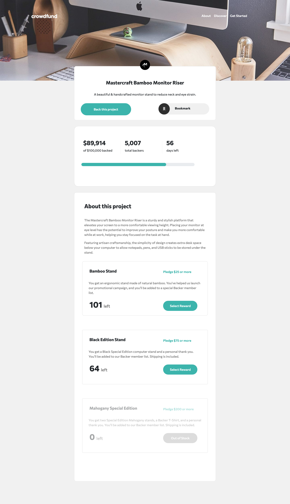
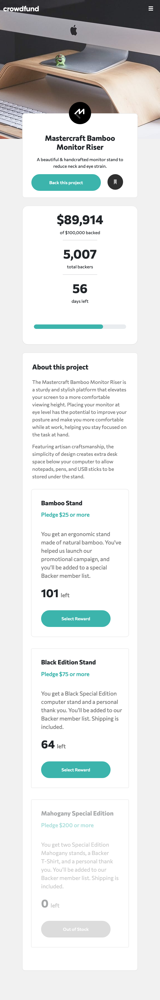

# Frontend Mentor - Crowdfunding product page solution

This is a solution to the [Crowdfunding product page challenge on Frontend Mentor](https://www.frontendmentor.io/challenges/crowdfunding-product-page-7uvcZe7ZR). Frontend Mentor challenges help you improve your coding skills by building realistic projects. 

## Table of contents

- [Overview](#overview)
  - [The challenge](#the-challenge)
  - [Screenshot](#screenshot)
  - [Links](#links)
- [My process](#my-process)
  - [Built with](#built-with)
  - [What I learned](#what-i-learned)
  - [Continued development](#continued-development)
  - [Useful resources](#useful-resources)
- [Author](#author)

## Overview

### The challenge

Users should be able to:

- View the optimal layout depending on their device's screen size
- See hover states for interactive elements
- Make a selection of which pledge to make
- See an updated progress bar and total money raised based on their pledge total after confirming a pledge
- See the number of total backers increment by one after confirming a pledge
- Toggle whether or not the product is bookmarked

### Screenshot

#### Desktop

#### Mobile

### Links

- Solution URL: [ Solution](https://github.com/rebekahshaw92//crowdfunding-product-page)
- Live Site URL: [Live Site](https://rebekahshaw92.github.io/crowdfunding-product-page)

### Built with

- Semantic HTML5 markup
- CSS custom properties
- Sass
- Bootstrap 5
- JavaScript
- Mobile-first workflow

### What I Learned

When undertaking this project I was able to continue to work with Bootstrap 5 and JavaScript. I learn how to check if a value is present with an htmol and covert it to any array using JavaScript so that I was able to disable a button. This was somthing I didn't know about before working on this project.

### Continued Development

I would like to continue working on this project by add an error message if they do not input a number when enetering the value they want to  pledge. I would also like to like to lower the number of items left each time the user makes a pledge.

### Userful Resources 

- [Bootstrap]https://getbootstrap.com) - This site helped me learn all I needed to know about Bootstrap.

## Author

- Website - [Rebekah Shaw](https://www.rebekahshaw.com)
- Frontend Mentor - [@rebekahshaw92](https://www.frontendmentor.io/profile/rebekahshaw92)
- Twitter - [@x_beckyboo_x](https://www.twitter.com/x_beckyboo_x)